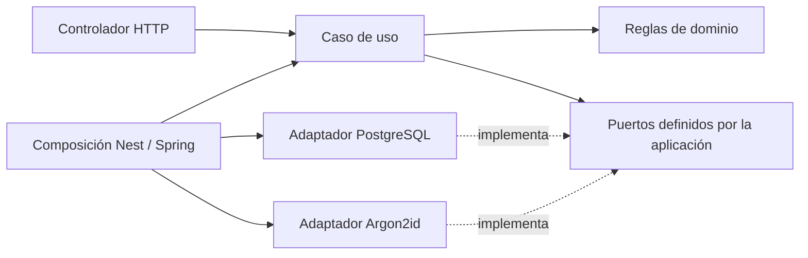

# 2. Los patrones se introducen por un problema

[Índice](README.md) · [Laboratorio SQL](03-laboratorio-transacciones-y-fallos.md)

Objetivo: poder justificar una abstracción y también decidir no usarla. Todo este capítulo asume **un servicio y una base**. Los patrones que solo aparecen al repartir datos entre servicios (saga, leases, reconciliación, outbox) están en el [apéndice distribuido](apendice-distribuido.md).

## 2.1 Una primera clasificación

| Patrón o técnica | Problema que resuelve aquí | Coste que introduce |
|---|---|---|
| Capas / puertos y adaptadores | Cambiar infraestructura sin reescribir reglas | Interfaces y composición |
| Caso de uso | Coordinar una intención completa | Más piezas que un CRUD directo |
| Repository + Unit of Work | Persistir entidades coherentemente | Definir bien la frontera transaccional |
| Máquina de estados | Evitar transiciones inválidas de token y sesión | Modelar todos los estados, no solo el camino feliz |
| Lock / versión optimista | Resolver escritores concurrentes | Espera, conflictos y posibles deadlocks |
| Restricción UNIQUE / índice parcial | Arbitrar carreras en la base | Diseñar el orden de escrituras |
| Rate limit | Acotar abuso de operaciones costosas | Contadores compartidos y recuperación |
| Validación de sesión | Detectar revocación | Consulta a la base en cada petición |

La cantidad de patrones no mide la calidad. Un patrón es útil si puedes señalar el fallo concreto que evita y demostrarlo con una prueba.

## 2.2 Capas: separar decisiones de mecanismos

Piensa en "renovar una sesión". La regla "un refresh consumido revoca la sesión" es una decisión del sistema. Prisma, JDBC o una respuesta HTTP 401 son mecanismos.

Distribución:

- **Dominio:** Session, RefreshToken y reglas de estado.
- **Aplicación:** RotateRefreshToken coordina lectura, decisión y persistencia.
- **Infraestructura:** SQL, Prisma/JDBC, criptografía.
- **Interfaz:** interpreta la request, valida forma y convierte resultado/error a HTTP.
- **Composición:** Nest Module o Spring Configuration conecta todo.



Las flechas describen dependencias de código o ensamblaje, no una secuencia de peticiones de red.

**Cuándo simplificar:** un endpoint de lectura trivial no exige entidad, puerto, servicio y mapper por cada columna. Aísla sobre todo las reglas de seguridad.

**Ejercicio:** elimina todos los imports de Nest/Spring de una regla de expiración. Debe poder probarse con objetos normales.

## 2.3 Inyección de dependencias no es el patrón de negocio

El caso de uso necesita "un reloj", no necesariamente Date.now o Instant.now. Lo recibe por constructor.

En producción inyectas el reloj real; en pruebas uno fijo. El algoritmo de expiración no cambia.

El contenedor de Nest o Spring automatiza crear objetos. También podrías conectarlos con new en un test. Si no puedes, quizá tu lógica depende demasiado del framework.

Una interfaz TypeScript desaparece al compilar; por eso Nest necesita un token real. Una interfaz Java conserva identidad de tipo y Spring puede resolver su implementación; si hay varias, requiere desambiguación.

## 2.4 Repository y Unit of Work: preguntas diferentes

Un Repository contesta "¿cómo cargo y guardo esta entidad?". Una Unit of Work contesta "¿qué cambios deben confirmarse juntos?".

Para registro:

- Crear identidad.
- Crear credencial.
- Si falla el segundo INSERT, la identidad no debe quedar sin contraseña.

Para login:

- Crear Session.
- Crear primer RefreshToken.

Para refresh:

- Consumir token anterior.
- Insertar sucesor.
- Enlazar ambos.
- Avanzar versión de sesión.

Tener dos métodos llamados save no significa que compartan transacción. Tienen que usar el mismo contexto transaccional real: el transaction client en Prisma; el transaction manager y su conexión en Spring/JDBC/JPA.

**Cuándo simplificar:** para una única escritura atómica no necesitas una Unit of Work genérica. Créala cuando haya coordinación real como esta.

## 2.5 Máquina de estados

Usar un string llamado status no es por sí solo una máquina de estados. También necesitas transiciones permitidas y condiciones.

Ejemplo de refresh token:

```text
ACTIVE ──rotación válida──▶ CONSUMED
ACTIVE ──replay o logout──▶ REVOKED
CONSUMED ──presentado otra vez──▶ (sin cambio de estado; dispara revocación de la sesión)
```

Y de sesión:

```text
ACTIVE ──logout / replay / admin──▶ REVOKED
ACTIVE ──llega absolute_expires_at──▶ (expirada; se calcula, no hace falta escribirla)
```

Una transición inválida debe rechazarse antes de persistirse.

**Ejercicio:** añade a cada flecha la columna "¿qué evidencia permite avanzar?". Si escribes solo "no lanzó error", vuelve a pensar en una respuesta perdida.

## 2.6 Idempotencia: cuándo la necesitas aquí

Con un servicio y una base, el registro no necesita claves de idempotencia para ser correcto: si el cliente reintenta un registro que ya se confirmó, la restricción UNIQUE del correo lo rechaza y respondes 409. Eso es suficiente para aprender.

Lo que **sí** debes separar:

1. Dos peticiones distintas con el mismo correo no crean dos cuentas → lo arbitra UNIQUE.
2. Un reintento del mismo cliente después de una respuesta perdida recibe 409 en vez del 201 original → es una limitación de experiencia, no de consistencia.

Si quieres que el reintento devuelva el mismo 201, necesitas una Idempotency-Key persistida. Está descrito en el [apéndice](apendice-distribuido.md#a2-idempotencia-con-clave); no es necesario para la ruta principal.

No uses "consultar y luego insertar" como único control. Ambas solicitudes pueden consultar antes de que alguna inserte.

## 2.7 Concurrencia: pesimista y optimista

**Pesimista:** bloqueo una fila mientras decido y escribo. Adecuado para consumir un refresh una sola vez. Mantén la transacción breve y usa siempre el mismo orden de locks (Session → RefreshToken).

**Optimista:** leo version=7 y actualizo con WHERE version=7. Si otra operación la llevó a 8, afecto cero filas y comunico conflicto. Adecuado para evitar sobrescritura silenciosa de un perfil.

Son mecanismos complementarios. El índice UNIQUE sigue siendo importante aunque uses un lock.

Un mutex JavaScript o synchronized Java protege una instancia del proceso; no coordina otra réplica. Si ejecutas dos instancias del mismo servicio contra la misma base, el árbitro debe ser la base.

## 2.8 Errores de dependencia: no confundir 401 con 503

| Situación | Respuesta correcta | Error frecuente |
|---|---|---|
| Contraseña incorrecta | 401 genérico | Decir "el usuario no existe" |
| La base no responde | 503 | Devolver 401 "credenciales inválidas" |
| Timeout de la base al consumir refresh | 503; el cliente no sabe si se consumió | Reintentar el refresh como si fuera un GET |

Un timeout no es "no ocurrió". No prometas "exactly once" porque haya retry.

## 2.9 Revocación y caché

La forma más simple de revocación inmediata: consultar la tabla session en cada petición autenticada. Es una consulta por request, y para un proyecto pequeño está bien.

Antes de añadir una caché pregunta cuánto tiempo aceptas una revocación atrasada:

- TTL corto reduce el intervalo; no lo hace cero.
- Invalidar caché puede fallar.

No añadas Redis para esto hasta tener una medición que lo justifique.

La introspección OAuth estándar tiene su propio contrato ([RFC 7662](https://www.rfc-editor.org/rfc/rfc7662.html)); un endpoint propio que dice "sesión válida" no es automáticamente una implementación de ese RFC.

## 2.10 Rate limit

Contar fallos y fijar el vencimiento deben ser una operación coherente. Con PostgreSQL puedes hacerlo en una sola sentencia (`INSERT ... ON CONFLICT DO UPDATE ... RETURNING`), sin Redis.

Tu política debe contestar:

- ¿Cuentas intentos o solo fallos?
- ¿Ventana fija o deslizante?
- ¿Un éxito limpia el contador?
- ¿Por qué clave cuentas: IP, correo normalizado (mejor su HMAC), o ambas?
- ¿Qué devuelves cuando el almacén del contador falla?

Si usas Redis más adelante, un script Lua es atómico respecto de otros comandos Redis; esa atomicidad no cubre una transacción PostgreSQL simultánea. [Scripting en Redis](https://redis.io/docs/latest/develop/programmability/eval-intro/).

## 2.11 Patrones que no necesitas imponer

- CQRS no exige dos bases.
- DDD no exige un microservicio por entidad.
- Hexagonal no exige una interfaz para cada función.
- Event sourcing no es un log de auditoría cualquiera.
- Un proveedor de identidad no elimina las reglas de tu negocio.

Práctica final: elige tres patrones de este capítulo. Para cada uno escribe una prueba que falla al quitarlo y una alternativa más simple que funcionaría con requisitos menos exigentes.
