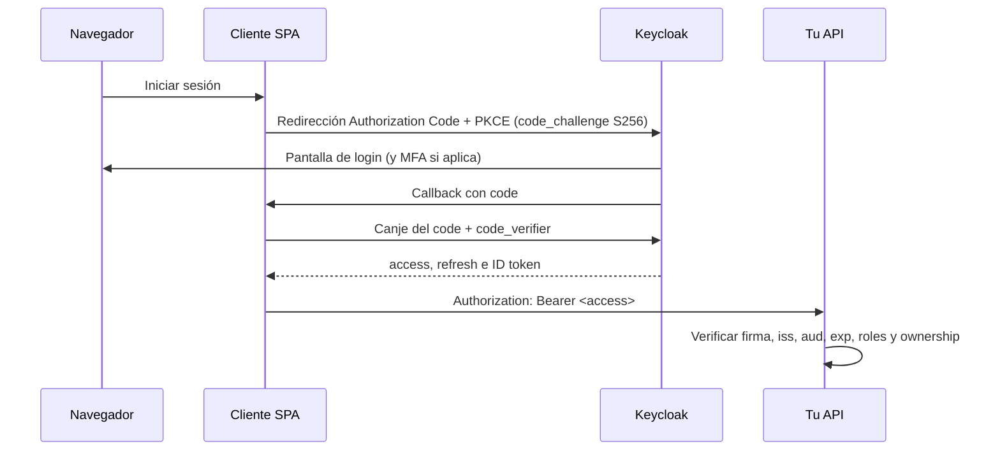

# 4. Delegar el login a Keycloak

[Índice](README.md) · Conexión: [Nest](nest/README.md) y [Spring](spring/README.md) · Siguiente: [MFA, email y recuperación](07-mfa-email-recuperacion.md)

Objetivo: dejar de verificar contraseñas en tu API y convertirla en consumidora de access tokens emitidos por Keycloak mediante Authorization Code + PKCE. Así puedes comparar qué desaparece de tu código y qué sigue siendo tuyo.

## 4.1 Separa tres ejes

1. **Quién administra identidad:** tu código, un proveedor autogestionado (Keycloak) o un servicio gestionado.
2. **Cómo se despliega:** un proceso o varias réplicas.
3. **Cómo autorizas cada request:** sesión consultada, JWT local, introspección.

Puedes tener una API pequeña con un proveedor de identidad externo sin que eso la vuelva "distribuida" en el sentido del apéndice: Keycloak es la única autoridad de credenciales y tu API solo verifica tokens.

## 4.2 Opciones

| Estrategia | Lo que mantienes tú | Ventaja | Coste o límite |
|---|---|---|---|
| Sesión opaca propia (etapa 1) | Identidad, credencial, sesión | Transacción local, revocación inmediata | Operar seguridad y almacén de sesiones |
| JWT + refresh propios (etapa 2) | Todo lo anterior + firma y rotación | Validación local en la API | Revocación, claves, pruebas |
| Keycloak autogestionado (etapa 3) | Configuración, integración, operación | Login, MFA, reset y OIDC ya implementados | Actualizaciones, BD, backups |
| Proveedor gestionado | Integración y políticas | Operación delegada | Dependencia externa, límites, coste |
| BFF + proveedor OIDC | Backend de sesión del navegador | Tokens fuera del navegador | Sesiones, CSRF, un componente más |

## 4.3 Qué cambia al usar Keycloak

Keycloak asume login, credenciales, MFA, verificación de email, recuperación y emisión de tokens. Tu API sigue decidiendo:

- Si el perfil pedido pertenece al usuario (ownership).
- Si el usuario puede realizar la acción de negocio.
- Cómo se crea el perfil local la primera vez.
- Qué pasa si el proveedor no responde.

No mantengas en tu API una segunda tabla de contraseñas "por si acaso": introduces dos fuentes de verdad.

Keycloak expone discovery OIDC, JWKS y endpoints de autorización, token, revocación e introspección. [Endpoints OIDC](https://www.keycloak.org/securing-apps/oidc-layers).

## 4.4 El flujo que practicarás



PKCE no cifra la contraseña: vincula el canje del code con quien inició el flujo, de modo que un code interceptado no sirve sin el code_verifier.

Usa una biblioteca OIDC para state, nonce, callbacks y validación. No uses el grant password (Direct Access Grants) como atajo para reutilizar tu formulario: [RFC 9700](https://www.rfc-editor.org/rfc/rfc9700.html) lo prohíbe (MUST NOT) y pide proteger los refresh de clientes públicos con rotación o vinculación al emisor.

El adaptador JavaScript oficial de Keycloak (`keycloak-js`, se publica por separado del servidor; la página de descargas indica 26.2.4 al consultar) usa Authorization Code y admite PKCE. [Adaptador JavaScript](https://www.keycloak.org/securing-apps/javascript-adapter).

## 4.5 Laboratorio Keycloak local

Usuarios sintéticos, contenedor desechable.

### Paso 1: proveedor

La guía oficial de Docker y la página de descargas muestran **26.7.4** como versión actual al consultar (2026-09-28). Fija el tag para poder repetir el experimento. `start-dev` es solo para desarrollo local. [Inicio con Docker](https://www.keycloak.org/getting-started/getting-started-docker).

```sh
docker run --name authlab-keycloak \
  -p 127.0.0.1:8180:8080 \
  -e KC_BOOTSTRAP_ADMIN_USERNAME=lab-admin \
  -e KC_BOOTSTRAP_ADMIN_PASSWORD=learning-only-change-me \
  quay.io/keycloak/keycloak:26.7.4 start-dev
```

Cada `\` debe ser el último carácter de su línea (sin espacios después). Con Podman, cambia `docker` por `podman`; el resto es igual.

> **Estado de verificación:** comando comparado con el de la guía oficial (misma imagen, mismas variables `KC_BOOTSTRAP_ADMIN_*`, `start-dev`; solo cambian nombre, puerto del host y credenciales). Sintaxis de continuación revisada por lectura; **no se ejecutó** en esta revisión.

La credencial es un ejemplo local. El contenedor no tiene volumen: si lo borras, pierdes la configuración. Exporta el realm si quieres repetirla.

Abre http://localhost:8180/admin, entra con lab-admin y crea el realm `authlab`. Usa master solo para administración.

### Paso 2: clientes, roles y audiencia

| Elemento | Valor |
|---|---|
| Realm | authlab |
| Emisor esperado | http://localhost:8180/realms/authlab |
| Cliente frontend | authlab-web (público) |
| Cliente que representa la API | authlab-api |
| Roles de cliente en authlab-api | GUEST, OWNER, ADMIN |
| Frontend local | http://localhost:5173 |
| Callback exacto | http://localhost:5173/callback |
| Audiencia esperada en la API | authlab-api |

authlab-web: cliente público (Client authentication OFF), Standard Flow activo, **PKCE Method = S256**, Direct Access Grants desactivado. Redirect URI y Web Origin exactos; sin comodines.

authlab-api: representa a la API; sin flujos interactivos. Define ahí los tres roles y asigna uno solo al usuario sintético.

Configura un mapper de audiencia para que el access token de authlab-web incluya `authlab-api` en `aud`. Comprueba con **Client scopes → Evaluate** y con un token real. [Administración: audiencia](https://www.keycloak.org/docs/latest/server_admin/index.html#audience-support).

No mapees roles desde atributos que el usuario pueda editar.

### Paso 3: cliente y callback

Crea una página local con keycloak-js configurada con url=http://localhost:8180, realm=authlab y clientId=authlab-web. Implementa /callback y una llamada a tu API. Pide PKCE S256 en la inicialización (consulta en la documentación del adaptador el nombre exacto de la opción para la versión que instales).

La prueba se completa cuando:

1. El navegador abre Keycloak para autenticar.
2. Vuelve al callback registrado.
3. La API recibe un access token.
4. La respuesta identifica al usuario sin que tu API haya visto su contraseña.

No guardes el refresh en localStorage. Para inspeccionar claims usa tokens sintéticos y no los compartas.

### Paso 4: API Nest o Spring

Sigue la sección de Resource Server de tu recorrido:

- Nest: `createRemoteJWKSet` + `jwtVerify` de jose con issuer, audience y algoritmos permitidos.
- Spring: Resource Server JWT con issuer-uri y audiences, más un converter para los roles de cliente.
- Ambos: vincular la identidad externa a un perfil local y aplicar ownership.

Discovery:

```text
http://localhost:8180/realms/authlab/.well-known/openid-configuration
```

Ejecuta tu API en el host para el primer laboratorio. Dentro de un contenedor, localhost no apunta al host; si luego usas Compose, diseña un hostname/issuer coherente. No "arregles" un error de issuer desactivando su validación.

### Paso 5: tests negativos obligatorios

| Prueba | Resultado que debes observar |
|---|---|
| Sin token | 401 |
| Firma alterada | 401 |
| Token de otro realm/emisor | 401 |
| Access token sin `aud` authlab-api | 401 |
| Token vencido | 401 |
| Usuario válido sin el rol requerido | 403 |
| Usuario válido pidiendo el perfil de otro | 403 (o 404, según tu regla) |
| ID token usado como access token | Rechazo (audiencia/tipo esperados no coinciden) |
| Se retira un rol en Keycloak | Mide qué pasa con el access ya emitido y con el siguiente |
| Logout en Keycloak | Mide si la API sigue aceptando el access hasta su exp |

No marques los dos últimos como "inmediatos" sin probarlo: con validación JWT local, un access ya emitido sigue siendo válido hasta exp.

## 4.6 Perfil local y vínculo con la identidad externa

```text
ExternalIdentity(issuer, subject) → userId local
UNIQUE(issuer, subject)
```

No uses el email como identidad externa estable: puede cambiar y su verificación depende del proveedor.

Opciones para crear el perfil local:

- **Just in time:** al primer request válido, crear el perfil de forma idempotente (INSERT ... ON CONFLICT DO NOTHING sobre issuer+subject).
- **Onboarding explícito:** estado pendiente hasta completar datos.

Para un proyecto pequeño, just in time es lo más simple.

## 4.7 Validar tokens: tres estrategias

| Estrategia | Trabajo por request | Lo que aceptas |
|---|---|---|
| JWT local con JWKS | Firma + claims + permiso local | Revocación no inmediata (hasta exp) |
| Introspección online | Llamada autenticada a Keycloak | Dependencia de disponibilidad y latencia |
| JWT + consulta de estado local | Firma y una lectura propia | Mantener ese estado coherente |

Para la etapa 3 usa JWT local con access tokens de vida corta. Anota el intervalo de revocación como un requisito conocido.

## 4.8 Otras plataformas (para comparar, no para instalar)

- **Auth0:** plataforma gestionada. [Conceptos IAM](https://auth0.com/docs/get-started/identity-fundamentals/identity-and-access-management).
- **Amazon Cognito:** user pools para usuarios de aplicación; identity pools sirven para obtener credenciales AWS. [Visión general](https://docs.aws.amazon.com/cognito/latest/developerguide/what-is-amazon-cognito.html).
- **ZITADEL:** federación OIDC/SAML. [Proveedores externos](https://zitadel.com/docs/guides/integrate/identity-providers/introduction).
- **Ory:** Kratos (identidad) y Hydra (OAuth2/OIDC) son piezas separadas. [Kratos](https://www.ory.com/docs/network/kratos/intro), [Hydra](https://www.ory.com/docs/network/hydra).
- **Spring Authorization Server:** para construir tu propio servidor OAuth/OIDC en Java; no sustituye la gestión de usuarios. [Overview](https://docs.spring.io/spring-authorization-server/reference/overview.html).

Para aprender basta comparar tu implementación propia con Keycloak.

## 4.9 Decisión razonada

1. Registro/login propio con sesión opaca: entiendes credenciales y sesiones.
2. JWT + refresh rotatorio: entiendes firma, transacciones y replay.
3. Keycloak: entiendes delegación y protocolos.
4. MFA, email y recuperación con Keycloak: ves cuánto trabajo delicado te ahorra.

Para un producto real nuevo, evalúa primero cuánto resuelve un proveedor antes de construir un Auth propio. Es un juicio de diseño, no una prohibición.
