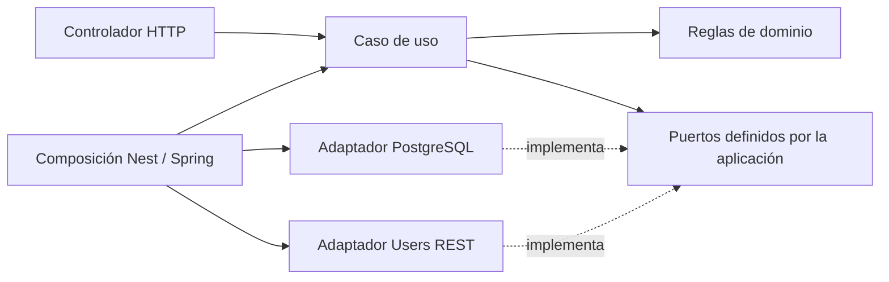

# 2. Los patrones se introducen por un problema

[Índice](README.md) · [Laboratorio de fallos](03-laboratorio-transacciones-y-fallos.md)

Objetivo: poder justificar una abstracción y también decidir no usarla. Los ejemplos y decisiones de este capítulo se aplican a StayHub; no son una plantilla obligatoria para cualquier login.

## 2.1 Una primera clasificación

| Patrón o técnica | Problema que resuelve aquí | Coste que introduce |
|---|---|---|
| Capas / puertos y adaptadores | Cambiar infraestructura sin reescribir reglas | Interfaces y composición |
| Caso de uso | Coordinar una intención completa | Más piezas que un CRUD directo |
| Repository + Unit of Work | Persistir entidades coherentemente | Definir bien la frontera transaccional |
| Máquina de estados | Evitar transiciones inválidas | Modelar recuperación, no solo camino feliz |
| Idempotencia | Repetir requests sin duplicar efectos | Claves, fingerprint, retención y concurrencia |
| Saga orquestada | Coordinar dos servicios sin una única transacción | Estados parciales y compensación |
| Lease + reconciliador | Recuperar trabajo tras caída de un proceso | Propiedad temporal y reintentos |
| Lock / versión optimista | Resolver escritores concurrentes | Espera, conflictos y posibles deadlocks |
| Timeout / retry / circuit breaker | Acotar fallos de dependencia | Políticas y pruebas de errores |
| Rate limit | Acotar abuso de operaciones costosas | Contadores compartidos y recuperación |
| Validación de sesión | Detectar revocación | Dependencia online y latencia |
| Pruebas de contrato | Detectar desacuerdo entre equipos | Versionar productores y consumidores |

La cantidad de patrones no mide la calidad. Un patrón es útil si puedes señalar el fallo concreto que evita y demostrarlo con una prueba.

## 2.2 Capas: separar decisiones de mecanismos

Piensa en “renovar una sesión”. La regla “un refresh consumido revoca la sesión” es una decisión del sistema. Prisma, JDBC o una respuesta HTTP 401 son mecanismos.

Distribución:

- **Dominio:** Session, RefreshToken y reglas de estado.
- **Aplicación:** RotateRefreshToken coordina lectura, decisión y persistencia.
- **Infraestructura:** SQL, Prisma, Redis, criptografía y cliente HTTP.
- **Interfaz:** interpreta request, valida forma y convierte resultado/error a HTTP.
- **Composición:** Nest Module o Spring Configuration conecta todo.



Las flechas del diagrama describen dependencias de código o ensamblaje, no una secuencia de peticiones de red.

**Cuándo simplificar:** un endpoint de lectura trivial no exige una entidad, un puerto, un servicio y un mapper por cada columna. En StayHub interesa aislar especialmente las reglas de seguridad y coordinación.

**Ejercicio:** elimina todos los imports de Nest/Spring de una regla de expiración. Debe poder probarse con objetos normales.

## 2.3 Inyección de dependencias no es el patrón de negocio

El caso de uso necesita “un reloj”, no necesariamente Date.now o Instant.now. Lo recibe por constructor.

En producción inyectas el reloj real; en pruebas uno fijo. El algoritmo de expiración no cambia.

El contenedor de Nest o Spring automatiza crear objetos. También podrías conectarlos usando new en un test. Si no puedes hacerlo, quizás tu lógica depende demasiado del framework.

Una interfaz TypeScript desaparece al compilar; por eso Nest necesita un token real. Una interfaz Java conserva identidad de tipo y Spring puede resolver su implementación; si hay varias, requiere desambiguación. El objetivo común es que el consumidor no construya sus dependencias.

## 2.4 Repository y Unit of Work: preguntas diferentes

Un Repository contesta “¿cómo cargo y guardo esta entidad?”. Una Unit of Work contesta “¿qué cambios deben confirmarse juntos?”.

Para login:

- Crear Session.
- Crear primer RefreshToken.
- Si falla el segundo INSERT, el primero no debe quedar como sesión usable sin su token.

Para refresh:

- Consumir token anterior.
- Insertar sucesor.
- Enlazar ambos.
- Avanzar versión de sesión.

Tener dos métodos llamados save no significa que compartan transacción. Tienen que usar el mismo contexto transaccional real.

En Nest/Prisma se ve en el transaction client; en Spring/JDBC/JPA, en el transaction manager y sus recursos. No basta con que ambos métodos se llamen desde la misma función.

**Cuándo simplificar:** para una única escritura atómica no necesitas una Unit of Work genérica sofisticada. Créala cuando haya una coordinación real como esta.

## 2.5 Máquina de estados

Usar un string llamado status no constituye por sí solo una máquina de estados. También necesitas transiciones permitidas y condiciones.

Ejemplo de registro:

```text
STARTED → USER_PENDING → CREDENTIAL_PENDING → CREDENTIAL_ACTIVE → COMPLETED
   estados recuperables → COMPENSATING → CANCELLED
```

COMPLETED exige observar identidad y credencial activas. No significa “ya llamé activate”.

Una transición inválida debe rechazarse antes de persistirse. El estado durable permite a otro proceso entender dónde continuar.

**Ejercicio:** añade la columna “¿qué evidencia permite avanzar?” a cada flecha. Si escribes solo “no lanzó error”, vuelve a pensar en un timeout.

## 2.6 Idempotencia: repetir la intención

Misma key y mismo contenido deben representar la misma operación. Misma key y contenido distinto es conflicto.

El fingerprint permite comparar sin almacenar el payload completo. Si contiene datos de baja entropía o derivados de password, utiliza el diseño seguro ya definido para el proyecto; un hash público no sustituye un HMAC secreto.

Dos problemas independientes:

1. Repetir una key no crea otra operación.
2. Dos keys distintas con el mismo correo no crean dos cuentas.

El primero corresponde a Auth; el segundo a la unicidad de Users.

No usar “consultar y luego insertar” como único control. Ambas solicitudes pueden consultar antes de que alguna inserte.

**Coste oculto:** debes definir qué devuelves al reintentar después de completar. Si Auth no guarda perfiles, necesita consultar el resumen a Users; esa repetición puede devolver 503 si Users no responde.

## 2.7 Saga: coordinar confirmaciones locales

Una saga combina pasos locales confirmados y acciones de compensación. La orquestación concentra la decisión del siguiente paso en un coordinador; la coreografía la reparte entre participantes que reaccionan a eventos. Esas son alternativas, no sinónimos. [Patrón de saga orquestada](https://docs.aws.amazon.com/prescriptive-guidance/latest/cloud-design-patterns/saga-orchestration.html).

Aplicación a StayHub:

1. Auth registra el avance.
2. Users crea identidad no autenticable.
3. Auth crea/activa credencial.
4. Users activa identidad.
5. Auth confirma ambos lados.

Cada paso puede sobrevivir a la caída del coordinador. Un try/catch con delete al final no proporciona esa propiedad.

**Compensación no es rollback temporal:** puedes cancelar una identidad todavía interna. No puedes borrar silenciosamente una cuenta activa que el usuario ya utilizó.

**Cuándo evitarla:** si identidad y credencial pertenecen a un mismo módulo y base, una transacción local puede resolver el problema. La saga aparece por la frontera de consistencia elegida.

## 2.8 Reconciliación y leases

Reconciliar significa comparar el avance registrado con la realidad y corregir una operación incompleta.

Un lease concede propiedad temporal sobre el trabajo. Ejemplo: worker A reclama hasta las 10:02; si muere, B puede continuar después del vencimiento.

Pero A podría estar pausado, no muerto. Si vuelve, debe comprobar que sigue siendo dueño antes de persistir.

Un UUID de owner con validación en cada escritura local ayuda a rechazar al trabajador antiguo. Para proteger efectos en un sistema remoto no basta con esa comprobación local: necesitas operaciones idempotentes, precondiciones remotas y, cuando corresponda, fencing tokens monotónicos que también valide el recurso receptor.

SKIP LOCKED ayuda a repartir filas entre workers. No garantiza por sí mismo recuperación tras commit: después de soltar los locks necesitas estado durable del reclamo. Tampoco es una lectura general consistente del conjunto, sino una herramienta para trabajo tipo cola. [PostgreSQL SELECT](https://www.postgresql.org/docs/16/sql-select.html).

**Ejercicio:** representa una pausa de A más larga que su lease. ¿Qué impide que anule lo hecho por B?

## 2.9 Concurrencia: pesimista y optimista

**Pesimista:** bloqueo una fila mientras decido y escribo. Adecuado para consumir un refresh una sola vez. Debes mantener la transacción breve y usar el mismo orden de locks.

**Optimista:** leo version=7 y actualizo con WHERE version=7. Si otra operación la llevó a 8, afecto cero filas y comunico conflicto. Adecuado para evitar sobrescritura silenciosa de perfil.

Son mecanismos complementarios. El índice UNIQUE sigue siendo importante incluso si utilizas un lock.

Un mutex JavaScript o synchronized Java protege una instancia del proceso; no coordina otra réplica o servidor. El almacén compartido debe arbitrar la condición compartida.

## 2.10 Resiliencia: cuatro decisiones distintas

| Técnica | Decisión | Error frecuente |
|---|---|---|
| Timeout | Cuánto espero antes de dar resultado desconocido | Interpretarlo como “no ocurrió” |
| Retry | Qué fallo puedo repetir y cuántas veces | Repetir un POST no idempotente |
| Backoff y jitter | Cuándo reintento sin sincronizar todos los clientes | Reintentos instantáneos masivos |
| Circuit breaker | Cuándo dejo de llamar temporalmente a una dependencia fallida | Considerarlo sustituto del timeout |

No prometas “exactly once” solo porque haya retry. Busca efectos idempotentes con identificación durable de la operación.

En este proyecto, un fallo de Users durante login es 503, no “password incorrecta”. Un circuit breaker abierto tampoco debe transformarse en usuario inexistente.

## 2.11 Caché y revocación

Antes de cachear una respuesta ACTIVE pregunta cuánto tiempo aceptas una revocación atrasada.

- TTL corto reduce el intervalo; no lo hace cero.
- Invalidar caché puede fallar.
- Varias réplicas pueden observar estados distintos.

La decisión actual de los planes es consultar PostgreSQL para autorizar la sesión. Un hit positivo no sustituye esa lectura. Si no aporta ahorro claro, puedes omitir la caché positiva hasta justificarla; no necesitas usar Redis para todo por tenerlo disponible.

El endpoint interno de StayHub recibe IDs de sesión/usuario, no exp del access token. No puede calcular el tiempo restante del JWT inventando una hora.

La introspección estándar OAuth tiene su propio contrato y autenticación del consumidor; el endpoint específico de StayHub no es automáticamente una implementación de RFC 7662. [OAuth Token Introspection](https://www.rfc-editor.org/rfc/rfc7662.html).

## 2.12 Rate limit y atomicidad

Contar fallos y fijar el vencimiento deben ser una operación coherente. Si incrementas y el proceso cae antes de EXPIRE, puedes dejar un contador persistente.

Redis puede ejecutar un script Lua atómicamente respecto de otros comandos; esa atomicidad cubre Redis, no una transacción PostgreSQL simultánea. [Scripting en Redis](https://redis.io/docs/latest/develop/programmability/eval-intro/).

Tu política además debe contestar:

- ¿Cuentas intentos o solo fallos?
- ¿La ventana es fija o deslizante?
- ¿Un éxito limpia el contador?
- ¿Qué devuelves cuando Redis falla?

StayHub separa límites por origen en Gateway y por identificador en Auth. Es una decisión de responsabilidades.

## 2.13 Outbox, inbox y eventos: alternativas futuras

Escribir en DB y después publicar un evento tiene una grieta: el proceso puede caer entre ambos. Una outbox guarda cambio y mensaje en la misma transacción local; un publicador procesa ese mensaje después. Puede haber reentrega, por lo que el consumidor debe ser idempotente; una inbox o clave procesada ayuda a deduplicar. [Transactional outbox](https://docs.aws.amazon.com/prescriptive-guidance/latest/cloud-design-patterns/transactional-outbox.html).

No hace atómicas dos bases. Tampoco sustituye sin más una respuesta autoritativa inmediata.

Para StayHub actual no hay que añadir broker por costumbre. Para un correo de bienvenida después del registro, en cambio, podría existir un caso concreto de publicación diferida.

## 2.14 Patrones que no necesitas imponer

- CQRS no exige dos bases. Separar comandos y consultas puede empezar con métodos claros.
- DDD no exige un microservicio por entidad.
- Hexagonal no exige una interfaz para cada función.
- Event sourcing no es un log de auditoría cualquiera.
- Un gateway no elimina la autorización del dueño del recurso.
- Un proveedor de identidad no elimina las reglas de tu negocio.

Práctica final: elige tres patrones de este capítulo. Para cada uno escribe una prueba que falla al quitarlo y una alternativa más simple que funcionaría bajo requisitos menos exigentes.
