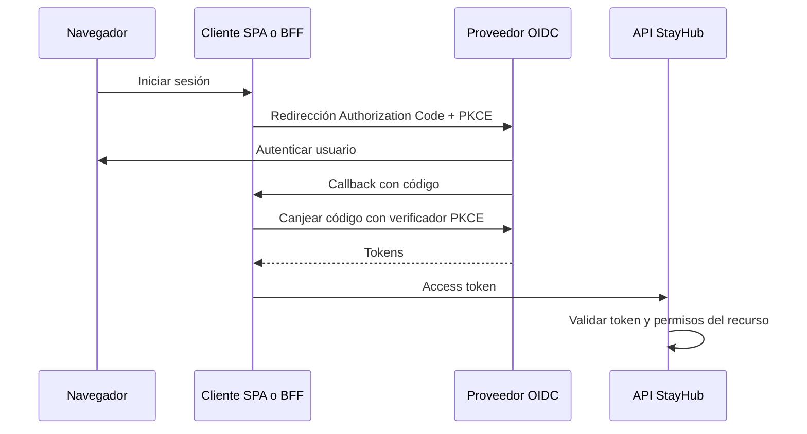

# 4. Elegir una estrategia de identidad

[Índice](README.md) · Conexión: [Nest](nest/README.md) y [Spring](spring/README.md).

Objetivo: decidir qué necesitas aprender, qué necesitas construir y qué conviene delegar. Las comparaciones siguientes son criterios de diseño aplicados a StayHub, no una evaluación comercial ni una promesa de menor coste en todos los contextos.

## 4.1 Separa tres ejes

“Keycloak o distribuido” no es una oposición:

1. **Quién administra identidad:** tu código, un proveedor autogestionado o un servicio gestionado.
2. **Cómo se despliega:** un proceso, varias réplicas o varios servicios de negocio.
3. **Cómo autorizas cada request:** sesión consultada, JWT local, introspección u otra política.

Puedes tener varias APIs con un único proveedor de identidad lógico, y desplegar ese proveedor con alta disponibilidad. También puedes desplegar un Auth propio en varias réplicas sin partir sus datos en servicios adicionales.

## 4.2 Opciones principales

| Estrategia | Lo que mantienes tú | Ventaja contextual | Coste o límite |
|---|---|---|---|
| Monolito modular + sesión opaca | Identidad, sesión y negocio | Transacciones locales y menos fronteras | Operar seguridad y almacén de sesiones |
| Auth propio + JWT/sesiones | Criptografía mediante librerías, políticas, revocación y recuperación | Control sobre reglas especiales | Pruebas, mantenimiento y respuesta a incidentes |
| Keycloak autogestionado | Configuración, integración, operación y negocio | Proveedor OIDC con capacidades de identidad ya implementadas | Actualizaciones, DB, backups, disponibilidad |
| Proveedor gestionado | Integración, políticas de tenant y negocio | Parte de operación delegada | Dependencia externa, límites, coste y migración |
| Spring Authorization Server | Un servidor de autorización construido sobre el framework | Personalización protocolaria en Java | Sigue siendo un producto que debes construir/operar |
| BFF + proveedor OIDC | Backend de sesión del navegador y APIs | Tokens permanecen en servidor | Sesiones, CSRF, despliegue adicional |

Una elección razonada depende de equipo, amenaza, experiencia, requerimientos y operación. No elijas microservicios para que un login parezca más profesional.

## 4.3 Qué cambiaría al usar Keycloak

En una alternativa de StayHub, Keycloak podría asumir login, credenciales y emisión de tokens. Tus APIs se convierten en consumidores de identidad y mantienen perfil y autorización de negocio.

No mantengas una segunda tabla de contraseñas activa en Auth “por si acaso” sin un plan explícito de migración: introduces dos fuentes de verdad.

La API sigue decidiendo:

- Si el perfil pedido pertenece al usuario.
- Si el usuario puede realizar la acción de negocio.
- Cómo se aprovisiona un perfil local.
- Qué pasa si el proveedor no responde.
- Qué identidad externa puede vincularse a una cuenta existente.

Keycloak expone discovery OIDC, claves públicas, endpoints de autorización/token e introspección. Esta última requiere autenticación de un cliente confidencial. [Endpoints OIDC](https://www.keycloak.org/securing-apps/oidc-layers).

## 4.4 El flujo moderno que practicarás



En SPA el cliente es código del navegador; en BFF el canje y los tokens están en el backend. PKCE no es cifrado del password: vincula el canje del código con quien inició el flujo.

Usa una biblioteca OIDC para state, nonce cuando corresponda, callbacks y validación del flujo. Evita trasladar la contraseña desde tu formulario a Keycloak mediante el grant password como atajo. RFC 9700 desaconseja ese diseño de manera normativa y establece protecciones para refresh de clientes públicos, como rotación o vinculación al emisor de la petición. [OAuth Security BCP](https://www.rfc-editor.org/rfc/rfc9700.html).

El adaptador JavaScript oficial de Keycloak utiliza Authorization Code y admite PKCE; conserva tokens en memoria y documenta su renovación. [Adaptador JavaScript](https://www.keycloak.org/securing-apps/javascript-adapter).

## 4.5 Laboratorio Keycloak local

Este experimento no modifica los contratos actuales de StayHub. Usa usuarios sintéticos.

### Paso 1: proveedor

La guía oficial consultada muestra la imagen 26.7.4. Fija un tag explícito para poder repetir el experimento; antes de usar otra versión revisa su guía. start-dev es únicamente para desarrollo local. [Inicio con Docker](https://www.keycloak.org/getting-started/getting-started-docker).

Comando de laboratorio, a ejecutar por ti en un entorno con Docker:

```sh
docker run --name stayhub-keycloak-learning +  -p 127.0.0.1:8180:8080 +  -e KC_BOOTSTRAP_ADMIN_USERNAME=lab-admin +  -e KC_BOOTSTRAP_ADMIN_PASSWORD=learning-only-change-me +  quay.io/keycloak/keycloak:26.7.4 start-dev
```

La credencial es un ejemplo local, no un secreto para despliegue. El contenedor no tiene volumen de persistencia configurado en este ejercicio; documenta/exporta configuración de laboratorio si quieres repetirla.

Abre http://localhost:8180, entra a la consola y crea el realm stayhub-lab. Usa master solo para administración.

### Paso 2: identidad y audiencia del laboratorio

Configura estos elementos propios del ejercicio:

| Elemento | Valor |
|---|---|
| Realm | stayhub-lab |
| Emisor esperado | http://localhost:8180/realms/stayhub-lab |
| Cliente frontend | stayhub-web |
| Cliente que representa la API | stayhub-api |
| Roles del cliente API | GUEST, OWNER, ADMIN |
| Frontend local | http://localhost:5173 |
| Callback exacto | http://localhost:5173/callback |
| Audiencia esperada en API | stayhub-api |

Crea stayhub-web como cliente público, sin secreto en el navegador, Standard Flow activo, PKCE S256 requerido y Direct Access Grants desactivado. Fija redirect/origen al laboratorio; no uses comodines generales.

Crea stayhub-api como representación de la API, sin flujos interactivos innecesarios. Define ahí los tres roles; asigna solo uno al usuario sintético.

Configura el alcance de roles del frontend y un mapper de audiencia para que su access token incluya stayhub-api. Comprueba el resultado con la función de evaluación de scopes y con un token real. La audiencia no debe inferirse solamente del nombre del frontend. Keycloak documenta mappers de audiencia y roles por cliente. [Administración: audiencia](https://www.keycloak.org/docs/latest/server_admin/index.html#_audience).

No añadas un mapper de role confiando en un atributo que el usuario pueda editar libremente.

### Paso 3: cliente y callback

Crea una página local de laboratorio con el adaptador oficial, configurado con url=http://localhost:8180, realm=stayhub-lab y clientId=stayhub-web. Implementa la ruta /callback y una llamada a tu API.

Configura pkceMethod=S256 y login por redirección. La prueba se completa cuando:

1. El navegador abre el proveedor para autenticar.
2. Vuelve al callback registrado.
3. La API recibe access token.
4. La respuesta identifica al usuario sin haber recibido su contraseña.

No almacenes refresh en localStorage para facilitar la inspección. Para observar claims utiliza solo tokens sintéticos y no los compartas en evidencia.

### Paso 4: API Nest o Spring

Sigue la sección Resource Server de la guía elegida:

- Nest: verificador de issuer/audience/algoritmo y JWKS confiable.
- Spring: Resource Server JWT y converter de client roles.
- Ambos: mapear identidad externa y aplicar ownership.

Comprueba discovery en:

```text
http://localhost:8180/realms/stayhub-lab/.well-known/openid-configuration
```

No supongas que localhost dentro de un contenedor apunta al host. Para el primer laboratorio ejecuta la API en el host. Para Compose diseña un hostname/issuer consistente y rutas alcanzables; no “arregles” un error de issuer desactivando su validación.

### Paso 5: negativos obligatorios

| Prueba | Resultado que debes observar |
|---|---|
| Sin token | 401 |
| Firma alterada | 401 |
| Otro realm/emisor | 401 |
| Access token sin audiencia stayhub-api | 401 |
| Usuario válido sin rol requerido | 403 |
| Usuario válido pidiendo perfil ajeno | 403 según regla del proyecto |
| ID token usado como access | Rechazo por contrato/audience/tipo esperado |
| Se retira un rol | Medir qué ocurre con access ya emitido y con el siguiente |
| Se cierra sesión en proveedor | Medir JWT local frente a comprobación online |

No marques los dos últimos como “inmediatos” sin probar la topología real.

## 4.6 Keycloak no es sustituto contractual automático

La configuración de Keycloak incluye políticas de lifespan, sesiones y rotación de refresh, pero la política exacta de StayHub requiere verificación. [Administración: sesiones y tokens](https://www.keycloak.org/docs/latest/server_admin/index.html).

Matriz que debes completar antes de una migración:

| Requisito StayHub | Qué comprobar con el proveedor |
|---|---|
| Access de una hora | Configuración del realm/cliente y exp efectivo |
| Límite absoluto de siete días desde login | Diferencia entre sesión SSO, sesión de cliente e idle timeout |
| Replay revoca familia completa | Comportamiento real, tolerancia a reuso y versión del proveedor |
| Rol inmutable durante toda sesión | Si refresh recalcula roles actuales |
| Correo nuevo sirve inmediatamente para login | Quién es autoridad del identificador y cómo se actualiza |
| Registro responde solo con cuenta completa | Cómo se coordina identidad externa con perfil local |
| Revocación inmediata en APIs | Validación local vs introspección/backchannel/estado local |

No afirmar equivalencia por habilitar “Revoke Refresh Token”. El requisito de rol fijo, en particular, puede no coincidir con lo que hace un proveedor al renovar claims.

Si la alternativa requiere cambiar esas promesas, se cambia primero la especificación, no se oculta la diferencia en el adaptador.

## 4.7 Perfil local y vínculo con identidad externa

Para un proveedor OIDC usa un vínculo local único:

```text
ExternalIdentity(issuer, subject) → userId local
UNIQUE(issuer, subject)
```

No uses email como identidad externa estable ni como prueba suficiente de que dos cuentas pertenecen a la misma persona. El email puede cambiar; dos proveedores y sus políticas de verificación no son equivalentes.

Opciones para crear el perfil:

- **Antes de permitir acceso:** onboarding síncrono y estado pendiente hasta completar.
- **Just in time:** al primer login válido, crear perfil idempotentemente y pedir datos faltantes.
- **Evento:** aprovisionar de manera asíncrona, aceptando y gestionando la espera.

Son decisiones del producto. Just in time puede simplificar el registro, pero modifica la promesa original de “registro completo antes de confirmar”.

Para cambiar correo, define un solo dueño del identificador de login. Si lo posee el proveedor, editar email solo en Users no actualiza necesariamente el login externo.

## 4.8 Validación distribuida: tres estrategias

| Estrategia | Trabajo por request | Propiedad que debes aceptar |
|---|---|---|
| JWT local con JWKS | Firma + claims + permiso local | Revocación no necesariamente inmediata |
| Introspección online | Llamada autenticada al emisor | Dependencia de disponibilidad y latencia |
| JWT + estado de sesión/revocación local | Firma y consulta a un estado mantenido | Coherencia de revocaciones entre componentes |

JWT local facilita validar en varias APIs sin llamar al emisor en cada petición; todavía dependes de distribución/rotación de claves y políticas coherentes.

Introspección puede consultar vigencia de tokens, pero cachearla vuelve a introducir un intervalo de revocación. Define ese intervalo como un requisito, no como un detalle accidental.

## 4.9 Réplicas, identidad de servicios y disponibilidad

No crees un servidor de usuarios distinto por microservicio. Para llamadas sin usuario, considera identidades de servicio separadas y client credentials con scopes/audiencias mínimos, o mTLS según la infraestructura. Un token de máquina no prueba que un huésped autorizó una acción.

Si una API actúa en nombre de un usuario, conserva la distinción entre actor servicio y sujeto usuario; no inventes un token de servicio con el userId del body.

Keycloak también puede desplegarse con alta disponibilidad, pero eso incluye dependencias y topología de datos. Varias réplicas no eliminan por sí solas una DB única como punto de fallo. [Alta disponibilidad Keycloak](https://www.keycloak.org/high-availability/introduction).

Para producción, los contenedores requieren configuración operativa distinta de start-dev, HTTPS/hostname, almacenamiento, secretos y un plan de actualización. [Guía de contenedores](https://www.keycloak.org/server/containers).

## 4.10 Otras plataformas que puedes comparar

Estas referencias describen posibilidades, no una recomendación de compra ni precios:

- **Auth0:** plataforma de identidad gestionada; evalúa capacidades necesarias, integración, exportación de identidades y operación delegada. [Conceptos IAM](https://auth0.com/docs/get-started/identity-fundamentals/identity-and-access-management).
- **Amazon Cognito:** user pools para identidades de aplicaciones; identity pools son otro componente orientado a obtener credenciales AWS. No los confundas. [Visión general](https://docs.aws.amazon.com/cognito/latest/developerguide/what-is-amazon-cognito.html), [identity pools](https://docs.aws.amazon.com/cognito/latest/developerguide/cognito-identity.html).
- **ZITADEL:** permite integrar proveedores externos mediante OIDC/SAML y configurar escenarios de federación. Evalúa el modelo de organizaciones y administración para tus requisitos. [Proveedores externos](https://zitadel.com/docs/guides/integrate/identity-providers/introduction).
- **Ory:** Kratos trata identidad/autenticación y Hydra la parte OAuth2/OIDC; distinguir componentes ayuda a entender qué debes ensamblar. [Kratos](https://www.ory.com/docs/network/kratos/intro), [Hydra](https://www.ory.com/docs/network/hydra).
- **Spring Authorization Server:** opción cuando construir y personalizar un servidor protocolario en Java es una necesidad explícita; no sustituye todo el trabajo de gestión de usuarios. [Overview](https://docs.spring.io/spring-authorization-server/reference/overview.html).

Para aprender, basta comparar tu laboratorio propio con Keycloak. No necesitas instalar cinco plataformas para entender la decisión.

## 4.11 Una decisión razonada para tu aprendizaje

Mi propuesta pedagógica:

1. Implementa registro/login local para comprender credenciales y sesiones.
2. Implementa una rotación concurrente para comprender transacciones.
3. Haz una saga reducida para comprender incertidumbre y recuperación.
4. Integra Keycloak para comprender delegación y protocolos.
5. Escribe qué elegirías para una aplicación pequeña y qué para un equipo con requisitos especiales.

Para un producto real nuevo, evaluaría primero cuánto puede resolver un proveedor o una sesión local mantenida antes de asumir el coste de un Auth distribuido propio. Es un juicio de diseño, no una prohibición de construir: la decisión debe apoyarse en requisitos que puedas nombrar.
